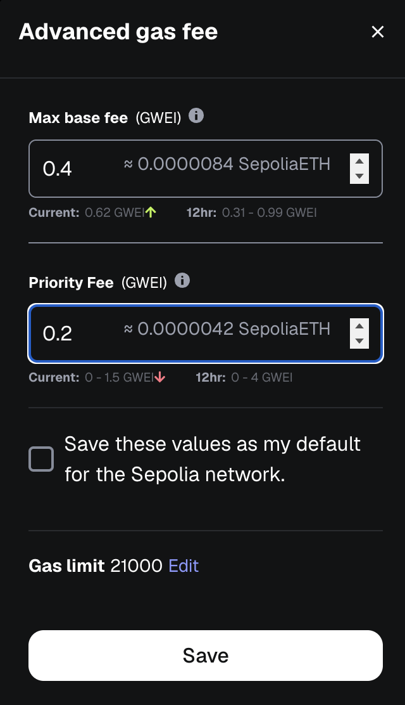
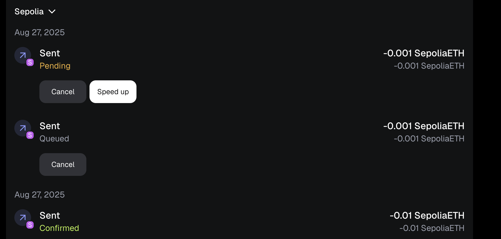
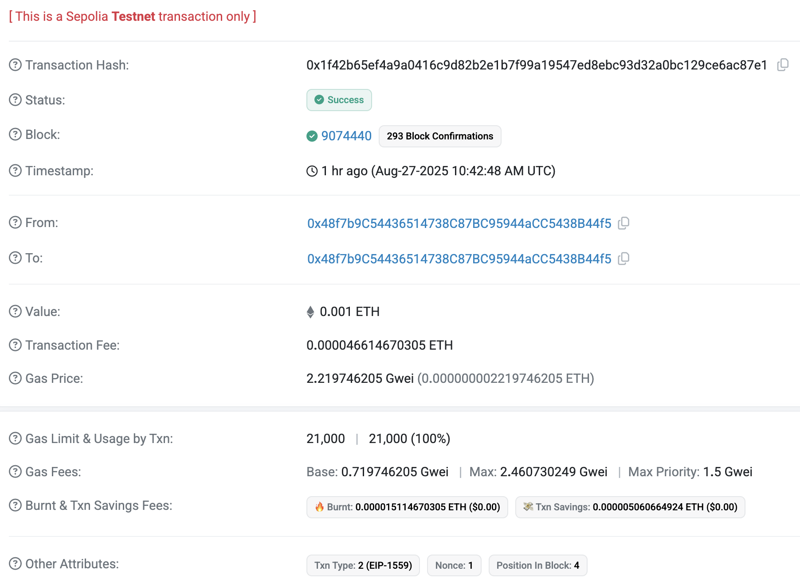
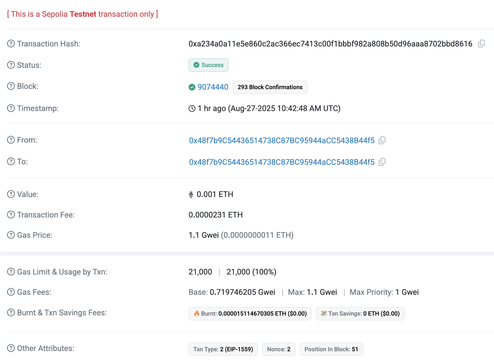

# Experiment: Ethereum Transactions, Nonces, and Gas (Sepolia Testnet)

 **This document records my first Ethereum transaction experiments on the Sepolia testnet.**  
**Goal**: to understand how nonces, gas, and Replace-by-Fee affect transaction lifecycle.

## 🔧 Setup

- Installed MetaMask and connected to Sepolia testnet  
- [Funded wallet using a public Sepolia faucet](https://sepolia.etherscan.io/tx/0xdac113ebbef98c75a40d9d38f7443556a78e5d0caedfbc39078d3a919f4a2b26)  

---

## 🧪 Experiment 1 – First Transaction (Nonce 0)

- Sent 0.01 SepoliaETH to my own address  
- Transaction confirmed successfully
- [Verified on Sepolia Etherscan](https://sepolia.etherscan.io/tx/0xb0f0fc0e23a6f020de2672b7cb4115406ded3a91a0b681465f0c03d338c8418f): saw transaction hash, block number, gas fee, and nonce = 0.

---

## 🧪 Experiment 2 – Forcing a Pending Transaction (Nonce 1)

- Set **nonce = 1**  
- Set gas fees far below market (Max base fee ~0.4 gwei, Priority fee ~0.2 gwei)  
- Transaction was valid but unattractive to validators → remained **Queued** in mempool.  

---

## 🧪 Experiment 3 – Sending Higher Nonce (Nonce 2)

- Sent another tx with **nonce = 2**  
- It was placed in **Pending** state, waiting for nonce 1 to confirm.
- Demonstrated how Ethereum enforces sequential nonces.

---

## 🧪 Experiment 4 – Replace-by-Fee (RBF)

- [Re-sent nonce = 1 with higher gas fees](https://sepolia.etherscan.io/tx/0x1f42b65ef4a9a0416c9d82b2e1b7f99a19547ed8ebc93d32a0bc129ce6ac87e1) (base ~2.5 gwei, priority ~1.5 gwei).
- New tx replaced the stuck pending one  
- Once nonce 1 confirmed, [nonce 2 confirmed automatically](https://sepolia.etherscan.io/tx/0xa234a0a11e5e860c2ac366ec7413c00f1bbbf982a808b50d96aaa8702bbd8616)

---

## 📌 Key Takeaways

- **Nonce** acts as a transaction counter, enforcing order and preventing replay  
- **Low gas** can block accounts (Denial-of-Service vector)  
- **Replace-by-Fee** allows overwriting or canceling pending transactions  
- Transaction ordering, controlled by nonces and gas fees, doesn’t just matter for simple ETH transfers. It’s also the basis of profit-driven behaviors in DeFi, such as **front-running and sandwich attacks**, where bots reorder trades in the mempool to extract value at the expense of normal users.
